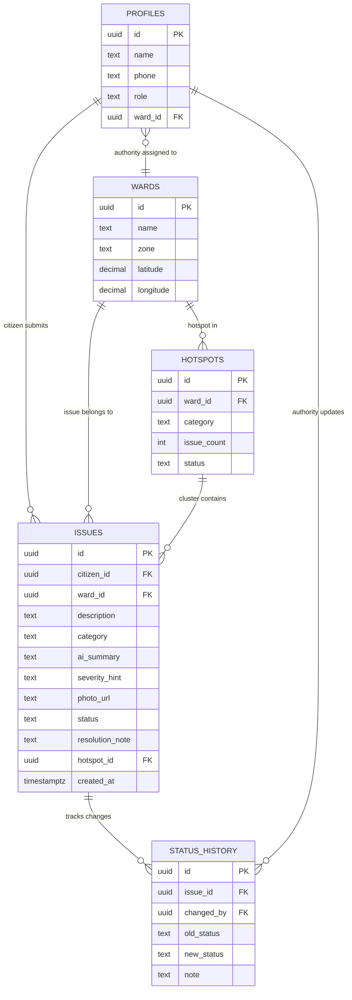

# 🚦 NAGPUR PULSE
### AI-Powered Civic Intelligence Platform for Nagpur
**Manthan4Yuva Hackathon · Open Innovation for Vikasit Nagpur**
> "Every ward. Every issue. Visible."

---

## TABLE OF CONTENTS

1. [Project Summary](#1-project-summary)
2. [Problem & Solution](#2-problem--solution)
3. [Tech Stack](#3-tech-stack)
4. [Product Scope — What to Build](#4-product-scope--what-to-build)
5. [User Roles](#5-user-roles)
6. [Complete User Workflows](#6-complete-user-workflows)
7. [Software Architecture](#7-software-architecture)
8. [Database Design](#8-database-design)
9. [API Design](#9-api-design)
10. [AI Architecture](#10-ai-architecture)
11. [Frontend Architecture](#11-frontend-architecture)
12. [UI/UX Design](#12-uiux-design)
13. [Security](#13-security)
14. [Deployment Architecture](#14-deployment-architecture)
15. [Environment Variables](#15-environment-variables)
16. [24-Hour Phase Plan](#16-24-hour-phase-plan)
17. [MVP Hard Cutoff](#17-mvp-hard-cutoff)
18. [Failure Strategy](#18-failure-strategy)
19. [Demo Script](#19-demo-script)
20. [Judging Strategy](#20-judging-strategy)
21. [Deployment Checklist](#21-deployment-checklist)
22. [GitHub README Structure](#22-github-readme-structure)
23. [Final Decision Summary](#23-final-decision-summary)

---

## 1. PROJECT SUMMARY

| Field | Value |
|---|---|
| **Project Title** | NAGPUR PULSE |
| **Theme** | Open Innovation for Vikasit Nagpur |
| **Hackathon** | Manthan4Yuva |
| **Venue (Day 2)** | VNIT Nagpur — Multi Activity Centre |
| **Team Size** | 5 (1 Lead + 4 Members) |
| **Build Time** | 24 Hours |
| **Pitch Time** | 2–3 minutes |
| **Institution** | JD College of Engineering & Management |

### What is NAGPUR PULSE?

NAGPUR PULSE is a citizen-driven civic intelligence platform that transforms raw complaints into structured, geo-clustered, AI-categorized urban issue intelligence for Nagpur's wards.

Citizens report civic problems (potholes, broken streetlights, drainage, garbage). The AI instantly categorizes and summarizes the report. When multiple reports cluster in the same ward zone, the system auto-detects a hotspot. Ward authorities see a prioritized intelligence dashboard — not 500 complaints, but 12 ranked hotspots. The public sees every ward's resolution rate. Accountability becomes visible and permanent.

---

## 2. PROBLEM & SOLUTION

### The Problem

Nagpur citizens have no effective way to report civic issues and verify they are resolved.

- Existing NMC portals lose complaints with no tracking
- Citizens have no visibility into whether their report did anything
- Ward officials receive unstructured, unranked complaint noise
- The same pothole gets reported 30 times but never gets fixed
- There is zero public accountability for ward-level resolution performance

### The Solution

NAGPUR PULSE adds an intelligence layer on top of citizen reporting:

```
Citizen reports issue (text + optional photo)
              ↓
AI auto-categorizes + summarizes (no manual tagging needed)
              ↓
Issue appears on public Nagpur ward map
              ↓
System detects: 3+ same-zone same-category reports = HOTSPOT
              ↓
Authority sees prioritized list: hotspots first, then individual issues
              ↓
Authority marks resolved → Citizen sees update
              ↓
Public dashboard: ward resolution rate, trending problems, live map
```

### Why This is Not a Generic Complaint Portal

| Generic Portal | NAGPUR PULSE |
|---|---|
| Manual category selection | AI auto-categorizes from free text |
| Individual complaints in a list | Geographic clustering → hotspot detection |
| No duplicate handling | Similar reports in same zone are grouped |
| Closed system — officials only | Public accountability dashboard |
| No ranking | Hotspots auto-prioritized by frequency |
| Static | Real-time ward health scores |

---

## 3. TECH STACK

```
Frontend          →  React + Vite + TypeScript + Tailwind CSS
Backend           →  Node.js + Express + TypeScript
Database          →  Supabase PostgreSQL
Authentication    →  Supabase Auth
File Storage      →  Supabase Storage
AI Layer          →  Google Gemini API (gemini-1.5-flash — free tier)
Map               →  Leaflet.js + OpenStreetMap (free, no API key)
Deployment (FE)   →  Vercel
Deployment (BE)   →  Render.com
```

### Why This Stack

- **React + Vite**: Fast setup, team familiarity, hot reload for rapid iteration
- **Express + Node**: Simple REST API, TypeScript support, fast to write
- **Supabase**: Postgres + Auth + Storage in one dashboard, generous free tier, RLS built-in
- **Gemini Flash**: Free tier available, fast responses, handles both text + vision, no credit card required for hackathon usage
- **Leaflet + OSM**: Zero cost, no API key, works offline if needed, Nagpur map data is complete
- **Vercel + Render**: Both have free tiers, instant deploy from GitHub, HTTPS automatic

> **No Upstash Redis for MVP.** At hackathon scale (judges + demo users), basic Express rate limiting middleware is sufficient. Redis adds setup complexity that risks the demo. Add post-hackathon.

---

## 4. PRODUCT SCOPE — WHAT TO BUILD

### MUST HAVE (Non-negotiable for demo)

- [ ] Issue submission form (text description + ward selector + optional photo)
- [ ] AI auto-categorization of submitted issue (Gemini)
- [ ] Issue map (Leaflet, all issues as colored pins by category)
- [ ] Hotspot detection (3+ same ward + same category = hotspot badge)
- [ ] Public ward dashboard (issue count, categories, resolution rate per ward)
- [ ] Authority login (separate dashboard)
- [ ] Authority can update issue status (Open → In Progress → Resolved)
- [ ] Citizen sees their issue status
- [ ] Pre-loaded demo seed data (30+ realistic Nagpur issues across 6 wards)
- [ ] Mobile responsive

### SHOULD HAVE (Add only if core is working by Hour 18)

- [ ] Photo upload with Gemini Vision description
- [ ] Trending issues section (top 3 citywide this week)
- [ ] Duplicate detection (similar report in same ward within 7 days)
- [ ] Share issue link

### DO NOT BUILD (Nice-to-have that will kill your demo)

- SMS/WhatsApp notification
- Real GPS auto-detection
- Push notifications
- Voting/upvoting on issues
- Multi-language (Marathi/Hindi)
- User profile page

### POST-HACKATHON (Future roadmap)

- NMC official API integration
- React Native mobile app
- Automated escalation system
- RTI filing integration
- ML model trained on Nagpur issue data
- Analytics for city planners

---

## 5. USER ROLES

### Role 1: Citizen (Public)

| Permission | Detail |
|---|---|
| **See** | Public map (all issues), ward dashboard, issue details, resolution status |
| **Create** | Submit new issue (requires name + email — Supabase magic link) |
| **Update** | Own issue description (before authority acts on it) |
| **Delete** | Cannot delete |
| **Scope** | Citywide view, all wards |

**Main workflow:** Visit site → See issues on map → Submit new issue → Track own issue status

---

### Role 2: Ward Authority (Official)

| Permission | Detail |
|---|---|
| **See** | All issues in assigned ward(s), cluster alerts, prioritized list |
| **Create** | Resolution notes, status updates |
| **Update** | Issue status (Open → In Progress → Resolved) + resolution comment |
| **Delete** | Flag as spam/duplicate (soft flag, not hard delete) |
| **Scope** | Ward-scoped — cannot see or act on other wards |

**Main workflow:** Login → See hotspot alerts → Open prioritized issue list → Update statuses → Add resolution notes

---

### Role 3: Admin (Platform)

| Permission | Detail |
|---|---|
| **See** | Everything across all wards |
| **Create** | Authority accounts, ward configuration, seed data |
| **Update** | Any issue, any status |
| **Delete** | Hard delete spam/abuse |
| **Scope** | Full platform |

**Main workflow:** Setup platform, manage authorities, monitor health, seed demo data

---

## 6. COMPLETE USER WORKFLOWS

### Workflow 1: Citizen Submits an Issue

```
1. Citizen visits nagpurpulse.vercel.app
2. Sees Nagpur map with colored issue pins
3. Clicks "Report an Issue" button
4. Prompted: Enter name + email (Supabase sends magic link)
5. Citizen clicks magic link → authenticated
6. Issue Form appears:
   - Description (text, 20–500 chars)
   - Ward selector (dropdown: Dharampeth, Sitabuldi, Gandhibagh, etc.)
   - Category hint (optional — AI will auto-assign anyway)
   - Photo upload (optional, max 5MB)
7. Submits → POST /api/issues
8. Backend:
   a. Validates input
   b. If photo: uploads to Supabase Storage, gets public URL
   c. Sends description + photo URL to Gemini API
   d. Gemini returns: { category, summary, severity_hint }
   e. Saves issue to DB with AI fields
   f. Runs clustering check:
      SELECT COUNT(*) FROM issues
      WHERE ward_id = $1 AND category = $2
      AND status != 'resolved'
      AND created_at > NOW() - INTERVAL '30 days'
      → If count >= 3: upsert into hotspots table
9. Response: { issue_id, category (AI), summary (AI), status: "open" }
10. Frontend:
    a. Shows success toast: "Issue #[ID] submitted. Track it here."
    b. New pin appears on map immediately
    c. Ward dashboard count updates
```

---

### Workflow 2: Authority Manages Issues

```
1. Authority visits /authority/login
2. Logs in with email/password (Supabase Auth)
3. Redirected to /authority/dashboard
4. Dashboard shows:
   a. HOTSPOT ALERTS — red cards (e.g., "Dharampeth: 5 pothole reports")
   b. Open Issues list (sorted: hotspot members first → recency)
   c. Resolution rate meter (e.g., "68% resolved this month")
5. Clicks a hotspot alert
6. Sees mini-map with all clustered pins
7. Opens individual issue:
   - AI summary, category, photo, citizen name, submission date
8. Updates status:
   - "In Progress" + note: "Assigned to roads dept"
   - "Resolved" + note: "Pothole filled Aug 17"
9. PATCH /api/issues/:id/status
10. Citizen's issue card updates (status badge changes)
11. Ward dashboard resolution rate recalculates
```

---

### Workflow 3: Public Views Ward Accountability

```
1. Anyone visits /dashboard
2. Sees:
   a. Map of all Nagpur wards
   b. Ward cards: Dharampeth (12 open, 8 resolved, 67%)
   c. Top 3 citywide categories this week
   d. Most active wards (most reports = needs attention)
3. Clicks a ward card
4. Sees: all issues in that ward, sorted by recency
5. Can filter by category or status
6. No login required
```

---

## 7. SOFTWARE ARCHITECTURE

```
┌─────────────────────────────────────────────────────┐
│                    NAGPUR PULSE                     │
├─────────────────────────────────────────────────────┤
│                                                     │
│  React + Vite + TypeScript (Vercel)                 │
│  ├── Public Map View (Leaflet + OSM)                │
│  ├── Issue Submission Form                          │
│  ├── Ward Dashboard                                 │
│  └── Authority Dashboard                           │
│                    │                               │
│                 HTTPS REST                         │
│                    │                               │
│  Node.js + Express + TypeScript (Render.com)        │
│  ├── /api/issues     (CRUD + clustering)            │
│  ├── /api/wards      (ward data)                   │
│  ├── /api/dashboard  (aggregated stats)            │
│  ├── /api/hotspots   (cluster alerts)              │
│  └── /health         (health check)                │
│          │                                         │
│    ┌─────┼──────────────────┐                      │
│    │     │                  │                      │
│ Supabase  Supabase       Gemini                    │
│ Postgres  Storage        Flash API                 │
│ + Auth    (photos)       (AI layer)                │
└─────────────────────────────────────────────────────┘
```

### Backend Project Structure

```
server/
├── src/
│   ├── config/
│   │   ├── supabase.ts        ← Supabase client (service role)
│   │   └── gemini.ts          ← Gemini API client
│   ├── controllers/
│   │   ├── issues.controller.ts
│   │   ├── wards.controller.ts
│   │   ├── dashboard.controller.ts
│   │   └── hotspots.controller.ts
│   ├── routes/
│   │   ├── issues.routes.ts
│   │   ├── wards.routes.ts
│   │   ├── dashboard.routes.ts
│   │   └── hotspots.routes.ts
│   ├── services/
│   │   ├── ai.service.ts      ← Gemini categorization logic
│   │   ├── clustering.service.ts ← Hotspot detection
│   │   ├── issues.service.ts
│   │   └── storage.service.ts ← Supabase Storage uploads
│   ├── middleware/
│   │   ├── auth.middleware.ts  ← Supabase JWT verification
│   │   ├── rateLimit.middleware.ts ← express-rate-limit
│   │   ├── validate.middleware.ts
│   │   └── errorHandler.ts
│   ├── validators/
│   │   ├── issue.validator.ts
│   │   └── status.validator.ts
│   ├── types/
│   │   ├── issue.types.ts
│   │   ├── ward.types.ts
│   │   └── ai.types.ts
│   ├── utils/
│   │   └── logger.ts
│   ├── app.ts                 ← Express app setup
│   └── server.ts              ← Entry point
├── .env.example
├── package.json
└── tsconfig.json
```

**Folder responsibilities:**
- `config/` — Initialize all external clients once, import everywhere
- `controllers/` — Handle HTTP req/res only, delegate logic to services
- `services/` — Business logic, AI calls, DB queries
- `routes/` — Route definitions + middleware attachment
- `middleware/` — Auth verification, rate limiting, validation, error handling
- `validators/` — Zod schemas for request body validation
- `types/` — Shared TypeScript interfaces

---

## 8. DATABASE DESIGN

### Tables

#### `profiles` (extends Supabase auth.users)
```sql
CREATE TABLE profiles (
  id          UUID PRIMARY KEY REFERENCES auth.users(id) ON DELETE CASCADE,
  name        TEXT NOT NULL,
  phone       TEXT,
  role        TEXT NOT NULL DEFAULT 'citizen'
              CHECK (role IN ('citizen', 'authority', 'admin')),
  ward_id     UUID REFERENCES wards(id),  -- NULL for citizen/admin
  created_at  TIMESTAMPTZ DEFAULT NOW()
);
```

#### `wards`
```sql
CREATE TABLE wards (
  id          UUID PRIMARY KEY DEFAULT gen_random_uuid(),
  name        TEXT NOT NULL UNIQUE,
  zone        TEXT,          -- e.g., 'East', 'West', 'Central'
  latitude    DECIMAL(9,6),  -- Center point for map
  longitude   DECIMAL(9,6),
  created_at  TIMESTAMPTZ DEFAULT NOW()
);
```

#### `issues` (core table)
```sql
CREATE TABLE issues (
  id              UUID PRIMARY KEY DEFAULT gen_random_uuid(),
  citizen_id      UUID NOT NULL REFERENCES profiles(id),
  ward_id         UUID NOT NULL REFERENCES wards(id),

  -- Citizen input
  description     TEXT NOT NULL CHECK (char_length(description) BETWEEN 20 AND 500),
  category_hint   TEXT,           -- Optional citizen hint

  -- AI-generated
  category        TEXT CHECK (category IN (
                    'pothole', 'streetlight', 'water', 'garbage',
                    'drainage', 'encroachment', 'other'
                  )),
  ai_summary      TEXT,           -- AI-generated clean summary
  severity_hint   TEXT CHECK (severity_hint IN ('low', 'medium', 'high')),

  -- Photo
  photo_url       TEXT,           -- Supabase Storage URL
  photo_description TEXT,         -- AI vision description of photo

  -- Status
  status          TEXT NOT NULL DEFAULT 'open'
                  CHECK (status IN ('open', 'in_progress', 'resolved', 'flagged')),
  resolution_note TEXT,
  resolved_by     UUID REFERENCES profiles(id),
  resolved_at     TIMESTAMPTZ,

  -- Clustering
  hotspot_id      UUID REFERENCES hotspots(id),

  -- Meta
  created_at      TIMESTAMPTZ DEFAULT NOW(),
  updated_at      TIMESTAMPTZ DEFAULT NOW()
);

-- Indexes for clustering queries
CREATE INDEX idx_issues_ward_category ON issues(ward_id, category);
CREATE INDEX idx_issues_status ON issues(status);
CREATE INDEX idx_issues_created_at ON issues(created_at DESC);
CREATE INDEX idx_issues_citizen ON issues(citizen_id);
```

#### `hotspots`
```sql
CREATE TABLE hotspots (
  id          UUID PRIMARY KEY DEFAULT gen_random_uuid(),
  ward_id     UUID NOT NULL REFERENCES wards(id),
  category    TEXT NOT NULL,
  issue_count INTEGER NOT NULL DEFAULT 0,
  status      TEXT NOT NULL DEFAULT 'active'
              CHECK (status IN ('active', 'resolved')),
  created_at  TIMESTAMPTZ DEFAULT NOW(),
  updated_at  TIMESTAMPTZ DEFAULT NOW(),

  UNIQUE(ward_id, category)  -- One hotspot per ward+category combination
);
```

#### `status_history` (audit trail)
```sql
CREATE TABLE status_history (
  id          UUID PRIMARY KEY DEFAULT gen_random_uuid(),
  issue_id    UUID NOT NULL REFERENCES issues(id) ON DELETE CASCADE,
  changed_by  UUID NOT NULL REFERENCES profiles(id),
  old_status  TEXT,
  new_status  TEXT NOT NULL,
  note        TEXT,
  changed_at  TIMESTAMPTZ DEFAULT NOW()
);
```

---

### ER Diagram



---

### Seed Data (Nagpur Wards)

```sql
INSERT INTO wards (name, zone, latitude, longitude) VALUES
  ('Dharampeth',    'West',    21.1458, 79.0882),
  ('Sitabuldi',     'Central', 21.1498, 79.0806),
  ('Gandhibagh',    'Central', 21.1551, 79.0878),
  ('Laxmi Nagar',  'East',    21.1420, 79.1190),
  ('Sadar',         'Central', 21.1522, 79.0916),
  ('Manewada',      'East',    21.1100, 79.1250),
  ('Nagpur Rural',  'Outer',   21.0800, 79.0600),
  ('Hingna',        'West',    21.1200, 78.9800);
```

---

## 9. API DESIGN

### Base URL: `/api`

All responses follow:
```json
{
  "success": true,
  "data": {},
  "error": null
}
```

---

### Issues Endpoints

#### `POST /api/issues`
- **Auth:** Required (citizen)
- **Rate limit:** 5 per hour per user
- **Request body:**
```json
{
  "description": "Large pothole near Dharampeth post office, 2 feet wide",
  "ward_id": "uuid",
  "category_hint": "pothole",
  "photo_url": "https://..." // optional, after upload
}
```
- **Response (201):**
```json
{
  "success": true,
  "data": {
    "id": "uuid",
    "category": "pothole",      // AI-assigned
    "ai_summary": "Deep pothole (~2ft) near Dharampeth post office posing vehicle damage risk",
    "severity_hint": "high",    // AI-assigned
    "status": "open",
    "hotspot_triggered": true   // if clustering threshold met
  }
}
```
- **Error responses:** 400 (validation), 401 (not authenticated), 429 (rate limit)

---

#### `GET /api/issues`
- **Auth:** None (public)
- **Query params:**
  - `ward_id` (filter by ward)
  - `category` (filter by category)
  - `status` (open / in_progress / resolved)
  - `page` (default 1)
  - `limit` (default 20, max 50)
- **Response (200):**
```json
{
  "success": true,
  "data": {
    "issues": [...],
    "total": 142,
    "page": 1,
    "limit": 20
  }
}
```

---

#### `GET /api/issues/:id`
- **Auth:** None (public)
- **Response (200):** Full issue object with status history

---

#### `PATCH /api/issues/:id/status`
- **Auth:** Required (authority or admin)
- **Authorization:** Authority can only update issues in their ward
- **Request body:**
```json
{
  "status": "resolved",
  "resolution_note": "Pothole filled by roads department on Aug 17"
}
```
- **Response (200):** Updated issue object

---

#### `POST /api/issues/upload-photo`
- **Auth:** Required (citizen)
- **Rate limit:** 10 per hour per user
- **Body:** multipart/form-data, field: `photo` (max 5MB, JPEG/PNG/WebP)
- **Response (200):**
```json
{
  "success": true,
  "data": {
    "url": "https://supabase-storage-url/...",
    "ai_description": "Image shows a large crack in road surface with water pooling"
  }
}
```

---

### Wards Endpoints

#### `GET /api/wards`
- **Auth:** None
- **Response:** All wards with coordinates

#### `GET /api/wards/:id/stats`
- **Auth:** None
- **Response:**
```json
{
  "ward_id": "uuid",
  "ward_name": "Dharampeth",
  "total_issues": 23,
  "open": 12,
  "in_progress": 4,
  "resolved": 7,
  "resolution_rate": 30.4,
  "category_breakdown": {
    "pothole": 8,
    "streetlight": 5,
    "garbage": 6,
    "drainage": 4
  }
}
```

---

### Hotspots Endpoints

#### `GET /api/hotspots`
- **Auth:** None (public)
- **Response:** All active hotspots with ward name, category, issue count

#### `GET /api/hotspots/:ward_id`
- **Auth:** Required (authority — ward-scoped)
- **Response:** Hotspots for that ward + list of clustered issues

---

### Dashboard Endpoint

#### `GET /api/dashboard`
- **Auth:** None (public)
- **Response:**
```json
{
  "total_issues": 187,
  "resolved_today": 12,
  "active_hotspots": 5,
  "city_resolution_rate": 58.3,
  "top_categories": ["pothole", "garbage", "streetlight"],
  "ward_rankings": [
    { "ward": "Dharampeth", "open": 12, "resolution_rate": 30 },
    ...
  ]
}
```

---

### Health Endpoint

#### `GET /health`
- **Auth:** None
- **Response:**
```json
{
  "status": "ok",
  "service": "nagpur-pulse-api",
  "timestamp": "2026-08-17T10:00:00Z"
}
```

---

## 10. AI ARCHITECTURE

### What AI does in NAGPUR PULSE

**Primary use:** Auto-categorize and summarize citizen issue reports from free-text descriptions.

**Secondary use:** Describe uploaded photos to enrich issue data.

### Why AI is genuinely needed here

Without AI:
- Citizens must manually select category (they often pick wrong ones)
- Free-text descriptions are messy and inconsistent — clustering becomes unreliable
- Photo content is unused

With AI:
- Any description in any phrasing maps to a consistent category
- Clustering works reliably because categories are consistent
- Photos contribute structured information

### AI Provider: Google Gemini Flash (gemini-1.5-flash)

**Reasons:**
- Free tier: 15 requests/minute, 1 million tokens/day
- Fast response (1–2 seconds)
- Handles both text and image (vision)
- No credit card required for hackathon usage
- Reliable uptime

---

### AI Workflow 1: Issue Categorization

**Input:**
```
description: "There is a huge hole in front of my house near Sitabuldi circle.
              My car tyre got damaged yesterday."
photo_description: (optional)
```

**Prompt to Gemini:**
```
You are a civic issue classifier for Nagpur Municipal Corporation.

Given this citizen report, return ONLY a JSON object with these exact fields:
{
  "category": one of [pothole, streetlight, water, garbage, drainage, encroachment, other],
  "summary": a clear 1-sentence summary under 100 chars,
  "severity_hint": one of [low, medium, high]
}

Severity guide:
- high: immediate safety risk, blocking road, no water supply
- medium: causes inconvenience, recurring issue
- low: minor, aesthetic

Citizen report: "[DESCRIPTION]"

Return ONLY the JSON. No explanation. No markdown.
```

**Output:**
```json
{
  "category": "pothole",
  "summary": "Large pothole near Sitabuldi circle causing vehicle damage",
  "severity_hint": "high"
}
```

**Failure handling:**
- If Gemini fails → assign `category: "other"`, `summary: description.slice(0, 100)`, `severity_hint: "medium"`
- System continues working — AI failure is not a crash

---

### AI Workflow 2: Photo Vision Analysis

**Input:** Image URL (Supabase Storage)

**Prompt:**
```
Describe what civic issue is visible in this image in one sentence.
Be specific: mention what you see (road, drain, light, etc.) and the problem.
Return ONLY the description sentence. No JSON. No extra text.
Maximum 120 characters.
```

**Output:** `"Road surface shows a 2-foot wide crack with water pooling at the edges"`

**Failure handling:**
- If Vision API fails → `photo_description: null`
- Issue is still saved with the photo URL

---

### Rate Limiting for AI Endpoints

Gemini free tier: 15 RPM

Express rate limiter on `POST /api/issues`:
```
windowMs: 60 * 1000    // 1 minute
max: 10                // 10 issue submissions per minute globally
```

On `POST /api/issues/upload-photo`:
```
windowMs: 60 * 60 * 1000   // 1 hour
max: 10 per user
```

---

### AI is NOT a Single Point of Failure

```
Gemini call succeeds → use AI results
Gemini call fails   → use fallback values → issue still saved
Demo works          → regardless of Gemini status
```

---

## 11. FRONTEND ARCHITECTURE

### Project Structure

```
client/
├── src/
│   ├── components/
│   │   ├── map/
│   │   │   ├── NagpurMap.tsx        ← Leaflet map component
│   │   │   ├── IssuePin.tsx         ← Colored map pin by category
│   │   │   └── HotspotCircle.tsx    ← Hotspot overlay circle
│   │   ├── issues/
│   │   │   ├── IssueCard.tsx
│   │   │   ├── IssueForm.tsx        ← Submit form
│   │   │   ├── IssueStatusBadge.tsx
│   │   │   └── IssueDetail.tsx
│   │   ├── dashboard/
│   │   │   ├── WardCard.tsx
│   │   │   ├── ResolutionMeter.tsx
│   │   │   ├── CategoryBreakdown.tsx
│   │   │   └── HotspotAlert.tsx
│   │   └── ui/
│   │       ├── Button.tsx
│   │       ├── Input.tsx
│   │       ├── Select.tsx
│   │       ├── Badge.tsx
│   │       ├── Toast.tsx
│   │       └── LoadingSpinner.tsx
│   ├── pages/
│   │   ├── HomePage.tsx             ← Map + submit button
│   │   ├── DashboardPage.tsx        ← Public ward dashboard
│   │   ├── IssueDetailPage.tsx      ← Single issue view
│   │   ├── SubmitIssuePage.tsx      ← Issue submission flow
│   │   ├── AuthPage.tsx             ← Login/magic link
│   │   └── authority/
│   │       ├── AuthorityLoginPage.tsx
│   │       └── AuthorityDashboard.tsx
│   ├── hooks/
│   │   ├── useIssues.ts             ← React Query hooks for issues
│   │   ├── useWards.ts
│   │   ├── useDashboard.ts
│   │   ├── useHotspots.ts
│   │   └── useAuth.ts               ← Supabase auth state
│   ├── services/
│   │   ├── api.ts                   ← Axios instance + base config
│   │   ├── issues.api.ts
│   │   ├── wards.api.ts
│   │   └── dashboard.api.ts
│   ├── lib/
│   │   └── supabase.ts              ← Supabase client (anon key only)
│   ├── types/
│   │   ├── issue.ts
│   │   ├── ward.ts
│   │   └── user.ts
│   ├── utils/
│   │   ├── categoryColors.ts        ← Map pin colors by category
│   │   └── formatters.ts
│   ├── routes/
│   │   └── AppRoutes.tsx            ← React Router + protected routes
│   └── App.tsx
├── index.html
├── vite.config.ts
├── tailwind.config.ts
└── package.json
```

### State Management

- **Server state:** React Query (TanStack Query) — all API data
- **Auth state:** Supabase Auth + React Context
- **Form state:** React useState (forms are simple enough)
- **No Redux/Zustand** — unnecessary complexity for this scope

### Protected Routes

```tsx
// Authority dashboard only accessible with authority/admin role
<Route path="/authority/*" element={
  <ProtectedRoute requiredRole="authority">
    <AuthorityDashboard />
  </ProtectedRoute>
} />
```

---

## 12. UI/UX DESIGN

### Design Philosophy

NAGPUR PULSE should feel like a serious civic-tech product — not a college project, not a generic government portal. The visual identity draws from:

- **Nagpur's identity:** Orange city (orange groves), infrastructure, civic pride
- **Tone:** Trustworthy, clear, action-oriented
- **Users:** Non-technical citizens on mobile, officials on desktop

### Color System

```
Primary:     #E8500A  (Nagpur orange — civic identity)
Background:  #0F1117  (dark base — serious, not playful)
Surface:     #1A1D27  (cards, panels)
Border:      #2A2D3A
Text High:   #F2F2F2
Text Muted:  #8B8FA8
Success:     #22C55E  (resolved)
Warning:     #F59E0B  (in_progress)
Danger:      #EF4444  (hotspot / open critical)
Info:        #3B82F6
```

### Category Colors (Map Pins)

```
pothole:      #EF4444  (red)
streetlight:  #F59E0B  (amber)
water:        #3B82F6  (blue)
garbage:      #84CC16  (lime)
drainage:     #8B5CF6  (purple)
encroachment: #F97316  (orange)
other:        #6B7280  (gray)
```

### Typography

```
Display/Headers:  Inter (700, 600) — clean, professional
Body:             Inter (400, 500)
Data/Labels:      JetBrains Mono — for ward IDs, counts, codes
```

### Pages

---

#### Landing / Home Page (`/`)

**Purpose:** First impression. Show the city's pulse immediately.

**Layout:**
```
┌──────────────────────────────────────────────────┐
│  🚦 NAGPUR PULSE          [Report Issue] [Login] │
│─────────────────────────────────────────────────│
│                                                  │
│  "Every ward. Every issue. Visible."             │
│                                                  │
│  [187 issues tracked] [58% resolved] [5 hotspots]│
│                                                  │
│  ┌────────────────────────────────────────────┐  │
│  │                                            │  │
│  │        NAGPUR MAP (Leaflet)                │  │
│  │   • colored pins by category              │  │
│  │   🔴 hotspot circles                      │  │
│  │   Click pin → mini issue card             │  │
│  │                                            │  │
│  └────────────────────────────────────────────┘  │
│                                                  │
│  Category filter: [All] [Pothole] [Water] [...]  │
└──────────────────────────────────────────────────┘
```

**Components:** Navbar, StatBar, NagpurMap, CategoryFilter, IssuePopup

**Empty state:** Map shows seed data — never empty during demo

---

#### Submit Issue Page (`/submit`)

**Purpose:** Citizen reports a problem. Must be fast, mobile-friendly.

**Layout:**
```
┌──────────────────────────────┐
│  ← Back   Report an Issue   │
│──────────────────────────────│
│                              │
│  Describe the problem *      │
│  ┌──────────────────────┐   │
│  │ Type what you see... │   │
│  └──────────────────────┘   │
│  (AI will auto-categorize)  │
│                              │
│  Select Ward *               │
│  [Dharampeth          ▼]    │
│                              │
│  Add Photo (optional)        │
│  [📷 Upload Photo]           │
│                              │
│  [Submit Issue →]            │
│                              │
│  ✓ Category assigned by AI  │
│  ✓ Appears on map instantly │
└──────────────────────────────┘
```

---

#### Ward Dashboard (`/dashboard`)

**Purpose:** Public accountability view.

**Layout:**
```
┌─────────────────────────────────────────────┐
│  City Overview          Last 30 days        │
│  187 total │ 109 resolved │ 58% city rate   │
│─────────────────────────────────────────────│
│  🔴 ACTIVE HOTSPOTS                         │
│  Dharampeth · Pothole · 8 reports           │
│  Sitabuldi  · Garbage · 5 reports           │
│─────────────────────────────────────────────│
│  WARD BREAKDOWN                             │
│                                             │
│  Dharampeth    ████░░░░  30% resolved  12↑ │
│  Sitabuldi     ██████░░  60% resolved   8↑ │
│  Gandhibagh    ████████  80% resolved   4↑ │
│  Laxmi Nagar   ███░░░░░  25% resolved  15↑ │
│                                             │
│  [View Issues] per ward                     │
└─────────────────────────────────────────────┘
```

---

#### Issue Detail Page (`/issues/:id`)

**Purpose:** Full view of one issue with status history.

**Shows:** AI summary, category badge, photo, ward, status timeline, resolution note

---

#### Authority Dashboard (`/authority/dashboard`)

**Purpose:** Ward official's action center.

**Layout:**
```
┌──────────────────────────────────────────────┐
│  Authority: Dharampeth Ward    [Logout]       │
│──────────────────────────────────────────────│
│  🚨 HOTSPOT ALERTS (2)                       │
│  ┌──────────────────────────────────────┐   │
│  │ 🔴 Pothole · 8 reports · View all   │   │
│  │ 🟡 Drainage · 4 reports · View all  │   │
│  └──────────────────────────────────────┘   │
│                                              │
│  OPEN ISSUES (12)    [Filter ▼] [Sort ▼]    │
│  ┌────────────────────────────────────────┐ │
│  │ #A1 Pothole · HIGH · 3 days ago       │ │
│  │ AI: Deep pothole near post office     │ │
│  │ [In Progress] [Resolved]              │ │
│  ├────────────────────────────────────────┤ │
│  │ #A2 Streetlight · MED · 1 day ago    │ │
│  │ ...                                   │ │
│  └────────────────────────────────────────┘ │
└──────────────────────────────────────────────┘
```

---

## 13. SECURITY

### Authentication

- **Citizens:** Supabase magic link (email OTP) — no password storage
- **Authorities:** Supabase email/password — bcrypt handled by Supabase
- **JWT tokens:** Issued by Supabase, verified by Express middleware
- **Token storage:** Supabase SDK stores in localStorage (acceptable for hackathon; use httpOnly cookies post-hackathon)

### Authorization

- All protected routes verify JWT via `auth.middleware.ts`
- Role extracted from `profiles.role` column
- Authority endpoints verify `ward_id` matches authority's assigned ward
- Admin endpoints require `role === 'admin'`
- **Never trust frontend role claims** — always verify from DB

### Supabase RLS Policies

```sql
-- PROFILES: Users can read own profile, admins read all
ALTER TABLE profiles ENABLE ROW LEVEL SECURITY;

CREATE POLICY "Users read own profile"
ON profiles FOR SELECT
USING (auth.uid() = id);

CREATE POLICY "Admin reads all profiles"
ON profiles FOR SELECT
USING (
  EXISTS (SELECT 1 FROM profiles WHERE id = auth.uid() AND role = 'admin')
);

-- ISSUES: Public read, authenticated insert, authority/admin update
ALTER TABLE issues ENABLE ROW LEVEL SECURITY;

CREATE POLICY "Public can read issues"
ON issues FOR SELECT
USING (status != 'flagged');

CREATE POLICY "Authenticated citizens can insert"
ON issues FOR INSERT
WITH CHECK (auth.uid() = citizen_id);

CREATE POLICY "Citizens can update own open issues"
ON issues FOR UPDATE
USING (
  auth.uid() = citizen_id
  AND status = 'open'
);

CREATE POLICY "Authority updates issues in their ward"
ON issues FOR UPDATE
USING (
  EXISTS (
    SELECT 1 FROM profiles
    WHERE id = auth.uid()
    AND role IN ('authority', 'admin')
    AND (ward_id = issues.ward_id OR role = 'admin')
  )
);

-- HOTSPOTS: Public read, backend inserts via service role only
ALTER TABLE hotspots ENABLE ROW LEVEL SECURITY;

CREATE POLICY "Public can read hotspots"
ON hotspots FOR SELECT
USING (true);

-- STATUS_HISTORY: Public read, authority/admin insert
ALTER TABLE status_history ENABLE ROW LEVEL SECURITY;

CREATE POLICY "Public can read status history"
ON status_history FOR SELECT
USING (true);

CREATE POLICY "Authority can insert status history"
ON status_history FOR INSERT
WITH CHECK (
  EXISTS (
    SELECT 1 FROM profiles
    WHERE id = auth.uid()
    AND role IN ('authority', 'admin')
  )
);
```

### Input Validation

- All request bodies validated with Zod before processing
- Description: min 20, max 500 chars, stripped of HTML
- Ward ID: valid UUID from allowed ward list
- Status values: enum checked
- Photo: MIME type check (JPEG/PNG/WebP only), 5MB max

### Other Security Measures

- CORS: restrict to frontend domain only
- Helmet.js: sets secure HTTP headers
- No raw SQL: all queries via Supabase client (parameterized)
- Environment variables: never committed to Git
- File uploads: validated before Supabase Storage write
- Error messages: generic to client, detailed in server logs only
- Rate limiting: express-rate-limit on all routes

### Realistic Limitations

- No WAF (Web Application Firewall) at hackathon scale
- Magic link emails could be delayed by Supabase free tier limits
- No fraud detection beyond basic rate limiting

---

## 14. DEPLOYMENT ARCHITECTURE

```
Citizens/Judges
      │
      │ HTTPS
      ▼
┌─────────────────┐
│  Vercel          │  ← React frontend
│  nagpurpulse.    │
│  vercel.app      │
└────────┬────────┘
         │ HTTPS REST
         ▼
┌─────────────────┐
│  Render.com      │  ← Node.js + Express API
│  Free tier       │
│  (Web Service)   │
└────────┬────────┘
         │
    ┌────┼────────────┐
    ▼    ▼            ▼
┌───────┐ ┌────────┐ ┌──────────────┐
│Supa-  │ │Supa-   │ │ Google       │
│base   │ │base    │ │ Gemini Flash │
│Postgr.│ │Storage │ │ API          │
└───────┘ └────────┘ └──────────────┘
Supabase Auth (shared)
```

### Hosting Decisions

| Service | Platform | Reason |
|---|---|---|
| Frontend | **Vercel** | Free, instant GitHub deploy, HTTPS auto, zero config for Vite |
| Backend | **Render.com** | Free web service tier, HTTPS, GitHub deploy, env vars, logs |
| Database | **Supabase** | Free tier: 500MB, 2 projects, built-in auth + storage |
| Storage | **Supabase Storage** | Free 1GB, integrated with DB auth |
| AI | **Google Gemini API** | Free tier sufficient for hackathon, fast, reliable |

### Cold Start Warning

Render.com free tier **spins down after 15 minutes of inactivity**. Solution for demo:
1. Hit the `/health` endpoint manually before the pitch starts
2. Keep a browser tab open to the authority dashboard 5 minutes before demo
3. Have a backup: run backend locally with `npx ts-node src/server.ts` if Render cold starts during demo

---

## 15. ENVIRONMENT VARIABLES

### Backend (`server/.env`)

```env
# Supabase
SUPABASE_URL=https://yourproject.supabase.co
SUPABASE_ANON_KEY=eyJ...          # Public — used for client operations
SUPABASE_SERVICE_ROLE_KEY=eyJ...  # SECRET — never expose to frontend

# Google Gemini
GEMINI_API_KEY=AIza...            # SECRET — server only

# App
PORT=3001
CLIENT_URL=https://nagpurpulse.vercel.app
NODE_ENV=production
```

### Frontend (`client/.env`)

```env
# Public Supabase (safe to expose — RLS protects data)
VITE_SUPABASE_URL=https://yourproject.supabase.co
VITE_SUPABASE_ANON_KEY=eyJ...

# Backend API URL
VITE_API_URL=https://nagpur-pulse-api.onrender.com
```

### What is server-only (NEVER in frontend):

- `SUPABASE_SERVICE_ROLE_KEY` — bypasses all RLS
- `GEMINI_API_KEY` — would expose your AI quota to anyone

### What is frontend-safe:

- `VITE_SUPABASE_URL` — public project URL
- `VITE_SUPABASE_ANON_KEY` — designed to be public, RLS restricts access

---

## 16. 24-HOUR PHASE PLAN

**Start: Aug 17, 10:00 AM IST**
**End: Aug 18, 10:00 AM IST**
**Pitch: Aug 18, after 10:00 AM at VNIT**

---

### Phase 1 — Project Setup (10:00 AM – 11:30 AM) · 1.5 hrs

**Goal:** Both frontend and backend are running locally and connected.

**Deliverables:**
- GitHub repo created with `/client` and `/server` folders
- `server/`: Express + TypeScript + Supabase client initialized
- `client/`: Vite + React + TypeScript + Tailwind initialized
- Supabase project created, environment variables configured
- `GET /health` returns `{ status: "ok" }`
- React app shows "NAGPUR PULSE" on screen with Tailwind working

**Definition of done:** Both run locally without errors. `/health` works.

---

### Phase 2 — Database + Auth (11:30 AM – 1:00 PM) · 1.5 hrs

**Goal:** Schema deployed, seed data loaded, auth working.

**Deliverables:**
- All 5 tables created in Supabase (`wards`, `profiles`, `issues`, `hotspots`, `status_history`)
- 8 Nagpur wards seeded
- 30 demo issues seeded across wards (realistic Nagpur data)
- RLS policies applied
- Supabase Auth configured (magic link for citizens, email/password for authorities)
- Demo authority account: `authority@dharampeth.nagpur` / password set
- Demo admin account: `admin@nagpurpulse.in` / password set

**Definition of done:** Can query issues from Supabase dashboard. Auth login works.

---

### Phase 3 — Core Backend API (1:00 PM – 4:00 PM) · 3 hrs

**Goal:** All critical API endpoints working without AI first.

**Deliverables:**
- `GET /api/issues` — returns paginated issues with ward filter
- `POST /api/issues` — saves issue with manual category (AI not connected yet)
- `GET /api/issues/:id` — returns single issue
- `PATCH /api/issues/:id/status` — authority status update with auth check
- `GET /api/wards` — all wards
- `GET /api/wards/:id/stats` — ward statistics
- `GET /api/dashboard` — citywide aggregated stats
- `GET /api/hotspots` — active hotspots
- Clustering logic working (checked on every POST /api/issues)
- Auth middleware working (protects authority routes)
- Rate limiting middleware on issue submission
- Zod validation on all inputs
- Error handler returning consistent responses

**Definition of done:** All endpoints tested with Postman/curl. Auth works. Issues submit and retrieve correctly.

---

### Phase 4 — Core Frontend (4:00 PM – 8:00 PM) · 4 hrs

**Goal:** Working UI connected to real backend.

**Deliverables:**
- Home page with Leaflet map showing seeded issues as colored pins
- Issue form working (text + ward selector → submits to API)
- Ward dashboard page showing ward stats + hotspot alerts
- Issue detail page
- Auth flow (magic link for citizen, login page for authority)
- Authority dashboard showing issues + status update buttons
- Protected routes working
- Mobile responsive (test on phone)
- Loading states + error states on all data fetches

**Definition of done:** Full citizen flow works end-to-end (submit → see on map). Authority can login and update status.

---

### Phase 5 — AI Integration (8:00 PM – 10:00 PM) · 2 hrs

**Goal:** Gemini categorizes issues on submission.

**Deliverables:**
- `ai.service.ts` calls Gemini with issue description
- Returns `{ category, ai_summary, severity_hint }`
- Fallback: if Gemini fails, use defaults (no crash)
- Photo upload endpoint working (Supabase Storage)
- Vision API describes photo on upload
- AI results show in issue detail page (category badge, AI summary)

**Definition of done:** Submit an issue → see AI-assigned category and summary on the map pin and issue detail.

---

### Phase 6 — Integration + Polish (10:00 PM – 1:00 AM) · 3 hrs

**Goal:** Everything works together smoothly.

**Deliverables:**
- End-to-end flow tested: submit → AI categorize → appear on map → hotspot → authority dashboard → resolve → dashboard updates
- UI polish: consistent colors, badges, spacing, dark theme
- Hotspot alert UI in authority dashboard
- Resolution rate meter on ward dashboard
- Map pin popups showing issue summary
- Toast notifications for actions
- Favicon and page title set ("NAGPUR PULSE")
- Check all empty states

**Definition of done:** Demo flow works without any manual interventions or refreshes.

---

### Phase 7 — Deployment (1:00 AM – 3:00 AM) · 2 hrs

**Goal:** Live URLs for both frontend and backend.

**Deliverables:**
- Backend deployed to Render.com
- Frontend deployed to Vercel
- Environment variables set in both platforms
- CORS configured for production URLs
- `/health` endpoint returning 200 on Render
- Auth works on production (Supabase redirect URLs updated)
- Seed data verified in production DB

**Definition of done:** `https://nagpurpulse.vercel.app` loads and is fully functional.

---

### Phase 8 — Testing + Bug Fixes (3:00 AM – 6:00 AM) · 3 hrs

**Goal:** No demo-breaking bugs remain.

**Test checklist:**
- [ ] Citizen submit flow (with and without photo)
- [ ] AI category appears correctly
- [ ] New issue pin appears on map
- [ ] Hotspot triggered when 3+ same ward + category
- [ ] Authority login and status update
- [ ] Ward dashboard resolution rate recalculates
- [ ] Mobile view usable
- [ ] Render cold start — ping `/health` before demo
- [ ] All demo seed data visible and correct

**Definition of done:** All checklist items pass. No console errors during demo flow.

---

### Phase 9 — Demo Prep (6:00 AM – 9:00 AM) · 3 hrs

**Goal:** Team is ready to pitch in 2–3 minutes.

**Deliverables:**
- Demo script rehearsed (see Part 19)
- Demo accounts bookmarked in browser
- Tabs open: Map page / Submit page / Authority dashboard / Ward dashboard
- 2 practice runs of full demo flow
- Backup plan ready: local backend running if Render cold starts
- Presentation talking points memorized

**Definition of done:** Team can deliver the demo in under 3 minutes without hesitation.

---

### Phase 10 — Buffer + Travel (9:00 AM – 10:00 AM) · 1 hr

Pack up, travel to VNIT, arrive early, ping Render health endpoint on arrival.

---

**Total: 24 hours exactly.**

---

## 17. MVP HARD CUTOFF

### ⛔ CUTOFF TIME: Hour 18 (4:00 AM Aug 18)

At this point, **no new major features are added**. Only bug fixes.

### Demo-Safe MVP (Must work by Hour 18)

If these 7 things work, NAGPUR PULSE can be demonstrated convincingly:

1. ✅ Citizen submits an issue with text + ward selector
2. ✅ AI assigns category and summary (or fallback works gracefully)
3. ✅ Issue appears as colored pin on Nagpur map
4. ✅ Ward dashboard shows issue counts and resolution rates
5. ✅ Hotspot appears when 3+ same-ward/category issues exist
6. ✅ Authority logs in and updates issue status
7. ✅ Dashboard resolution rate updates after status change

### Optional Features (Add only if core is rock-solid)

- Photo upload + vision AI description
- Trending issues section
- Duplicate detection badge

### Features to Abandon if Behind Schedule

If you are behind at Hour 14, immediately drop:
- ❌ Photo upload (replace with placeholder image in demo)
- ❌ Vision AI analysis
- ❌ Duplicate detection
- ❌ Trending section
- ❌ Share link feature

The 7 demo-safe items are non-negotiable. Everything else is optional.

---

## 18. FAILURE STRATEGY

### AI (Gemini) Fails

**During dev:** Continue — set `category: "other"`, `ai_summary: description.slice(0,100)`, `severity_hint: "medium"`

**During demo:** The issue still submits. Tell judges: "AI categorization is asynchronous — it processes in the background. Here you can see the fallback summary while AI updates." Show a pre-categorized seeded issue instead.

---

### Supabase Temporarily Fails

**During dev:** Wait 5 minutes — Supabase free tier has occasional cold start on projects.

**During demo:** Have local PostgreSQL fallback with pg docker container seeded. Switch backend `.env` `SUPABASE_URL` to `localhost` if needed.

Simpler fallback: use hardcoded demo data JSON served from backend if Supabase is down.

---

### Render.com Cold Start During Demo

**Prevention:** Open browser tab to `/health` 5 minutes before pitch.

**If it happens during demo:** Switch to locally running backend. Have `npm run dev` running on one team member's laptop connected to hotspot. Change `VITE_API_URL` in browser console to `localhost:3001`.

---

### Vercel Frontend Fails

**Fallback:** Run `npm run dev` locally. Demo from localhost on team member laptop connected to projector. Vercel outages are extremely rare.

---

### Internet Becomes Unstable at VNIT

**Prevention:** One team member creates mobile hotspot before pitch.

**Fallback:** Have seed data pre-loaded in browser (React Query caches responses). Map still shows (Leaflet tiles cached). Submit form can show mock success if API unreachable.

---

### Photo Upload Fails

**Fallback:** Remove photo from demo. Issue submits without photo. Tell judges: "Photo upload is a SHOULD HAVE — the core intelligence works without it."

---

### Authentication Breaks

**Fallback:** Disable auth guard on authority dashboard temporarily. Show the dashboard directly. Tell judges: "Auth is implemented — I can show the login separately." Demo the data, not the login flow.

---

## 19. DEMO SCRIPT

**Total time: 2 minutes 30 seconds**

---

### Act 1 — The Problem (20 seconds)

*[Show map with existing seed issues visible]*

> "In Nagpur, a pothole on a busy road might get reported by 20 different citizens — but each complaint goes to a different inbox, gets lost, and the pothole remains for months. Citizens have no accountability. Officials are overwhelmed by noise. Nothing gets fixed."

---

### Act 2 — Citizen Reports (40 seconds)

*[Open Submit Issue page]*

> "Meet Ravi, a citizen from Dharampeth. He spots a broken streetlight on his street."

*[Type description: "The streetlight near Dharampeth post office has been broken for a week. My street is dark at night and unsafe."]*

*[Select ward: Dharampeth]*

> "He just describes it in plain language. No forms to fill, no category to guess."

*[Click Submit]*

> "Instantly — our AI reads his description and assigns: category Streetlight, severity Medium, and generates a clean summary."

*[Show the new pin appearing on the map in Dharampeth]*

> "His report is now live on the public map."

---

### Act 3 — Intelligence Layer (30 seconds)

*[Zoom to Dharampeth ward on map — show 3+ red hotspot circle]*

> "But here's what makes NAGPUR PULSE different. Our system has detected that 5 citizens have reported streetlight issues in Dharampeth this month. It automatically creates a HOTSPOT — a verified cluster of related issues that demands attention."

*[Open ward dashboard]*

> "The public ward dashboard shows Dharampeth has 12 open issues, a 30% resolution rate — and 2 active hotspots. Any citizen can see this. Any journalist can see this. This is public accountability."

---

### Act 4 — Authority Acts (30 seconds)

*[Login to authority dashboard as Dharampeth authority]*

> "Now the ward officer logs in. Instead of 12 individual complaints, they see 2 prioritized hotspots at the top. They open the streetlight cluster."

*[Click In Progress → add note → Save]*

> "They mark it In Progress and assign it to the maintenance team."

*[Switch back to ward dashboard — show resolution rate tick up]*

> "The public dashboard updates immediately. Citizens can see their ward is responding."

---

### Act 5 — Future (20 seconds)

> "NAGPUR PULSE requires no government API, no hardware, no special infrastructure. Any citizen with a phone can use it today. Post-hackathon, we integrate with NMC's official systems and scale across all 145 wards of Nagpur. The city's pulse — visible to everyone."

---

## 20. JUDGING STRATEGY

### 30-Second Opening

> "Every day, Nagpur citizens report the same potholes, the same broken lights, the same blocked drains — and nothing happens. Not because officials don't care. Because complaints disappear into black holes with no structure, no priority, and no accountability. NAGPUR PULSE changes that."

---

### What to Emphasize to Judges

| Judge likely asks | Your answer |
|---|---|
| "How is this different from NMC's portal?" | "NMC's portal collects complaints. We process them. AI categorization + geographic clustering + public dashboard = intelligence, not just a form." |
| "What AI does it use?" | "Google Gemini Flash — categorizes free-text descriptions in 1 second, assigns severity, describes photos. No custom model training." |
| "Can this actually be used?" | "Yes — no government API needed. Citizens use it today. Authorities get a login. The public dashboard needs zero access." |
| "How does it scale?" | "Supabase + Vercel + Render — handles thousands of users. Clustering algorithm is O(n) with indexed queries." |
| "What's your business model?" | "Municipal SaaS — license to NMC/smart city initiative. Or NGO/grant funded." |

---

### Innovation Framing

> "Every city has a complaint portal. No city has a civic intelligence layer. The difference is: we don't store your complaint — we process it into actionable intelligence that makes the entire city more accountable."

---

## 21. DEPLOYMENT CHECKLIST

### Pre-Deploy (Phase 7 checklist)

- [ ] GitHub repository created and pushed
- [ ] Supabase project created
- [ ] All 5 tables created with correct schema
- [ ] RLS policies applied and tested
- [ ] Supabase Storage bucket created (`issue-photos`, public read)
- [ ] Demo ward seed data inserted (8 wards)
- [ ] Demo issue seed data inserted (30+ issues across wards)
- [ ] Demo authority account created
- [ ] Demo admin account created
- [ ] Supabase Auth: magic link enabled, redirect URL set to Vercel URL

### Backend Deploy (Render.com)

- [ ] Render.com account created
- [ ] New Web Service created, connected to GitHub
- [ ] Build command: `npm install && npm run build`
- [ ] Start command: `node dist/server.js`
- [ ] All backend environment variables set in Render dashboard
- [ ] `/health` returns 200 on Render URL
- [ ] CORS set to Vercel frontend URL

### Frontend Deploy (Vercel)

- [ ] Vercel account created
- [ ] Project connected to GitHub `/client` folder
- [ ] `VITE_SUPABASE_URL`, `VITE_SUPABASE_ANON_KEY`, `VITE_API_URL` set
- [ ] Build succeeds with no TypeScript errors
- [ ] App loads on Vercel URL

### Final Verification

- [ ] Submit an issue from Vercel URL → appears on map
- [ ] AI category assigned (check Render logs if needed)
- [ ] Authority login works on production
- [ ] Authority can update status
- [ ] Ward dashboard shows correct stats
- [ ] Hotspot appears for demo data
- [ ] Mobile: test on phone browser
- [ ] Open `/health` tab to prevent Render cold start
- [ ] Demo script practiced on production URL

---

## 22. GITHUB README STRUCTURE

```markdown
# 🚦 NAGPUR PULSE
### AI-Powered Civic Intelligence Platform for Nagpur
> "Every ward. Every issue. Visible."

Built for Manthan4Yuva Hackathon · Open Innovation for Vikasit Nagpur

[Live Demo](https://nagpurpulse.vercel.app) · [API](https://nagpur-pulse-api.onrender.com/health)

---

## The Problem
[2-paragraph problem description]

## The Solution
[2-paragraph solution with what makes it different]

## Features
- 🗺️ Live issue map with category-colored pins
- 🤖 AI auto-categorization (Google Gemini)
- 🔥 Automatic hotspot detection (geographic clustering)
- 📊 Public ward accountability dashboard
- 🔐 Authority dashboard with prioritized issue management
- 📸 Photo upload with AI vision analysis

## Architecture
[ASCII architecture diagram]

## Tech Stack
| Layer | Technology |
|---|---|
| Frontend | React + Vite + TypeScript + Tailwind |
| Backend | Node.js + Express + TypeScript |
| Database | Supabase PostgreSQL |
| Auth | Supabase Auth |
| Storage | Supabase Storage |
| AI | Google Gemini Flash |
| Map | Leaflet.js + OpenStreetMap |
| Deploy FE | Vercel |
| Deploy BE | Render.com |

## Screenshots
[Add screenshots after building]

## Local Development
### Prerequisites
- Node.js 20+
- Supabase account
- Google AI Studio account (Gemini API key)

### Setup
[Step by step instructions]

## Environment Variables
[Tables of required env vars]

## API Overview
[Key endpoints listed]

## Security
[Brief security approach description]

## Future Roadmap
- NMC official API integration
- React Native mobile app
- Automated escalation system
- 145-ward coverage

## Team
| Name | Role |
|---|---|
| [Team Lead] | Full Stack + AI |
| [Member 2] | Backend + DB |
| [Member 3] | Frontend + Map |
| [Member 4] | UI/UX + Frontend |
| [Member 5] | DevOps + Demo |

## License
MIT
```

---

## 23. FINAL DECISION SUMMARY

| Field | Decision |
|---|---|
| **Project** | NAGPUR PULSE |
| **Tagline** | Every ward. Every issue. Visible. |
| **Theme fit** | Direct — civic intelligence for Vikasit Nagpur |
| **Core innovation** | AI categorization + geographic clustering + public accountability layer |
| **Not a** | Generic complaint portal / CRUD app / AI chatbot |

### 5 Most Important Features

1. **AI Auto-Categorization** — Gemini reads free text, assigns consistent category/severity
2. **Geo-Clustering / Hotspot Detection** — 3+ same ward + category = verified hotspot
3. **Live Public Map** — Leaflet map, real-time issue pins, visible to everyone
4. **Public Accountability Dashboard** — Ward resolution rates, publicly visible
5. **Authority Intelligence View** — Hotspots first, then prioritized issues

### Why This Can Win

- **Demonstrates in 2 minutes** — submit → AI → map → hotspot → authority → resolve — complete story
- **Solves a real Nagpur problem** — judges are from Nagpur, they know this pain
- **Technical depth is real** — AI + clustering + RLS + full-stack is not trivial
- **Innovation is specific** — not just "AI-powered", but specifically AI enabling reliable clustering
- **Scalable story** — easy to explain path from hackathon → NMC integration → Nagpur-wide

### Biggest Risk

Render.com cold start during demo.

**Mitigation:** Ping `/health` 5 minutes before pitch. Have local backend running as backup.

### Second Biggest Risk

Gemini API rate limit hit during live demo submission.

**Mitigation:** Use pre-seeded demo data for most of the demo. Only submit 1 new issue live. Fallback assigns "other" category gracefully.

### Backup Project (if team votes to switch)

**SchemeSaathi** — Government scheme eligibility engine. Easier to build, lower technical risk, same social impact score. Switch to this only if CivicPulse is rejected by the team before Hour 4.

---

*NAGPUR PULSE — Built in 24 hours. For 5 million Nagpur citizens.*
*Manthan4Yuva · Open Innovation for Vikasit Nagpur · JDCOEM Team*
```
